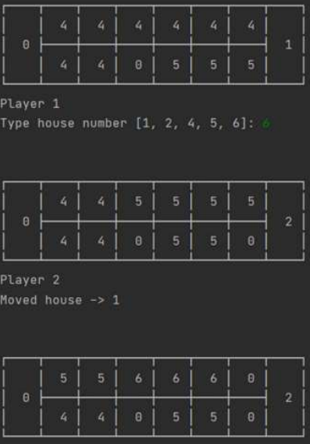

# Mankala
Console implementation of [mankala game](https://en.wikipedia.org/wiki/Mancala) made in Python 3.  
Game implementation contains different AI algorithms - Min-Max and Alfa-Beta with different heuristics.

## Screenshots

## Contact
Created by **Jędrzej Ratajczak** ([@nilphym](https://github.com/nilphym)) - feel free to contact me!
